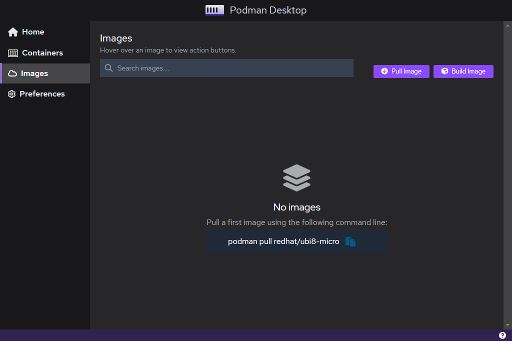
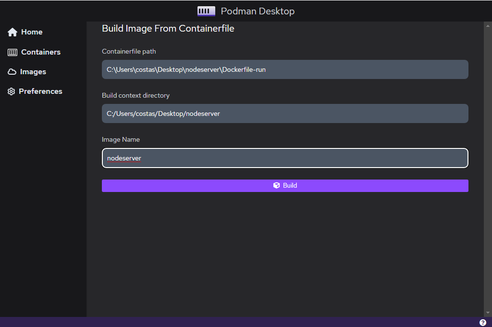
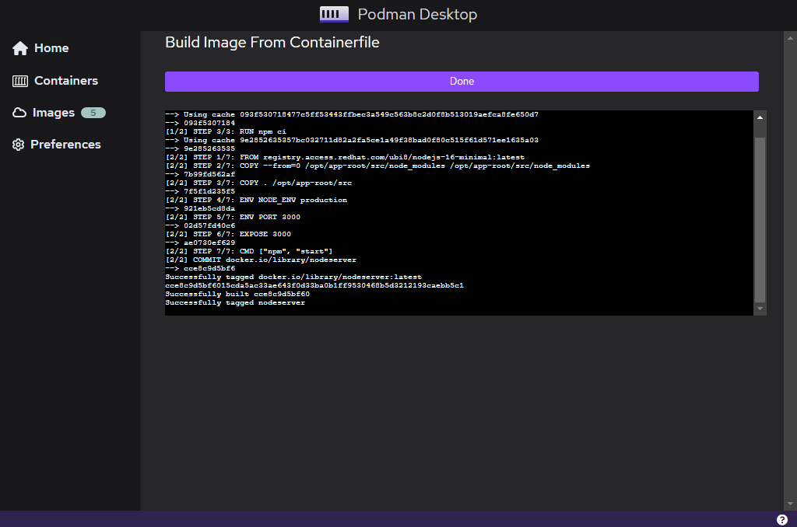
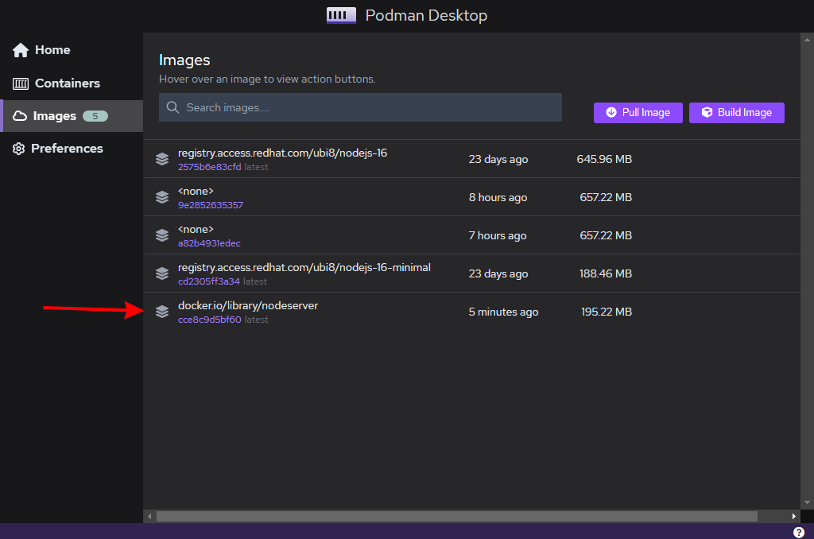
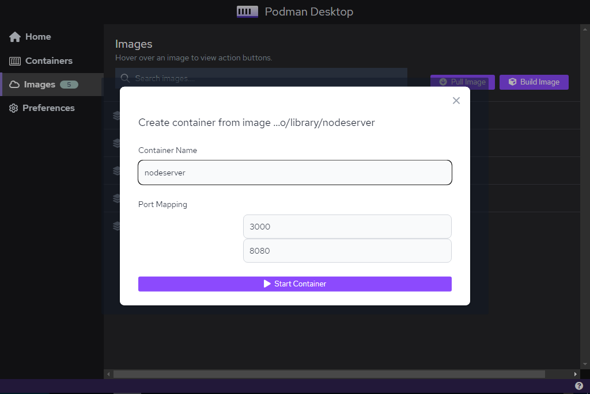
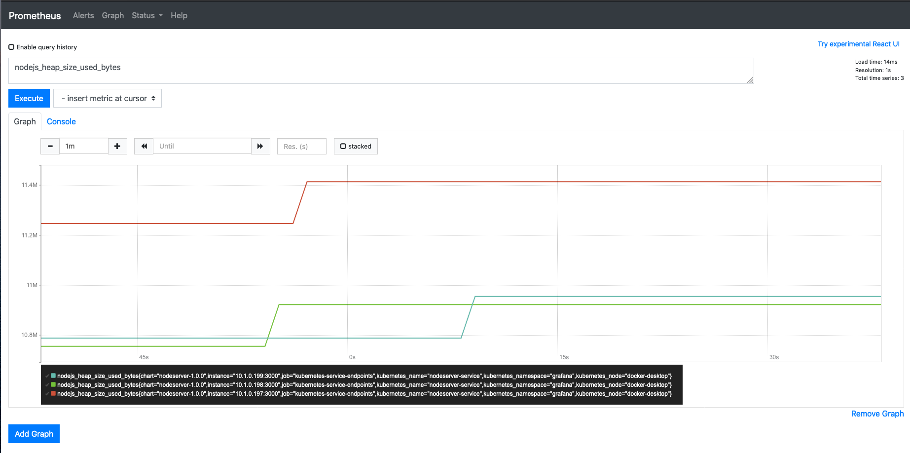
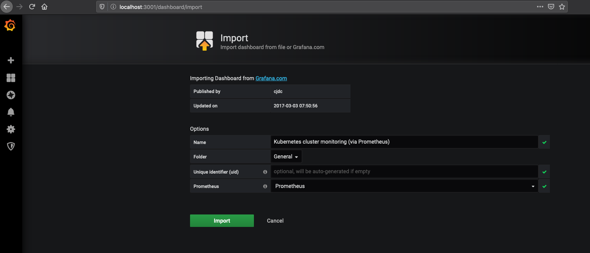

# Node.js in the Cloud

Welcome :wave: to the Node.js in the Cloud workshop!

The workshop provides an introduction to cloud-native development with Node.js by walking you through how to extend an Express.js-based application to leverage cloud capabilities.

**Target Audience:** This workshop is aimed at developers who are familiar with Node.js but want to gain a base understanding of some of the key concepts of cloud-native development with Node.js.

## Extending an application to leverage cloud capabilities

### Building a Cloud-Ready Express.js Application

This will show you how to take a Node.js application and make it "cloud-ready" by adding support for Cloud Native Computing Foundation (CNCF) technologies.

In this self-paced tutorial you will:

- Create an Express.js application
- Add logging, metrics, and health checks
- Build your application with Podman
- Package your application with Helm
- Deploy your application to Kubernetes
- Monitor your application using Prometheus

The application you'll use is a simple Express.js application. You'll learn about Health Checks, Metrics, Podman, Kubernetes, Prometheus, Grafana. In the end, you'll have a fully functioning application running as a cluster in Kubernetes, with production monitoring.

The content of this tutorial is based on recommendations from the [NodeShift Reference Architecture for Node.js](https://github.com/nodeshift/nodejs-reference-architecture).

## Prerequisites

Before getting started, make sure you have the following prerequisites installed on your system.

1. Install [Node.js 16](https://nodejs.org/en/download/) (or use [nvm](https://github.com/nvm-sh/nvm#installing-and-updating) for linux, mac or [nvm-windows](https://github.com/coreybutler/nvm-windows#installation--upgrades) for windows)
1. Podman v4 (and above)
   - **On Mac**: [Podman](https://podman.io/getting-started/installation#macos)
   - **On Windows**: Skip this step, as for installing Podman you will get prompt during Podman Desktop installation.
   - **On Linux**: [Podman](https://podman.io/getting-started/installation#installing-on-linux)
1. Podman Desktop
   - **On Mac**: [Podman Desktop](https://podman-desktop.io/downloads/macOS)
   - **On Windows**: [Podman Desktop](https://podman-desktop.io/docs/Installation/windows-install)
   - **On Linux**: [Podman Desktop](https://podman-desktop.io/docs/Installation/linux-install)
1. Kubernetes
   - **On Mac**: [minikube](https://minikube.sigs.k8s.io/docs/start/)
   - **On Windows**: [minikube](https://minikube.sigs.k8s.io/docs/start/)
   - **On Linux**: [minikube](https://minikube.sigs.k8s.io/docs/start/)
1. Helm v3 - [Installation](./README.md#installing-helm-v37)
   - **Note**: This workshop tested with Helm v3.7

## Setting up

### Starting Podman Machine

#### Linux

Nothing to do, no Podman machine is required on Linux

#### On Mac

After installing podman, open a terminal and run below commands to initialize and run podman machine:

_**NOTE:** \*On Apple M1 Pro chip, system version has to be 12.4 and above._

```
podman machine init --cpus 2 --memory 8096 --disk-size 20
podman machine start
podman system connection default podman-machine-default-root
```

#### On Windows

1. Launch Podman Desktop and on the home tab click on **install podman**. In case of any missing parts for podman installation (e.x. wsl, hyper-v, etc.) follow the instructions indicated by Podman Desktop on the home page. In that case you might need to reboot your system several times.

1. After installing podman, set WSL2 as your default WSL by entering below command in PowerShell (with administration priviledges).

   ```
   wsl --set-default-version 2
   ```

1. On Podman Desktop Home tab -> click on **initialize Podman** -> wait till the initialization is finished
1. On Podman Desktop Home tab -> click on **Run Podman** to run podman.

### Starting Kubernetes

#### On Mac:

1. install minikube
   ```
   brew install minikube
   ```
1. start minikube
   ```
   minikube start --driver=podman --container-runtime=cri-o
   ```

#### On Windows:

1. Download minikube
   ```
   https://storage.googleapis.com/minikube/releases/latest/minikube-installer.exe
   ```
1. Rename `minikube-windows-amd64.exe` to `minikube.exe`
1. Move minikube under `C:\Program Files\minikube` directory

1. Add `minikube.exe` binary to your `PATH system variable`

   1. Right-click on the **Start Button** -> Select **System** from the context menu -> click on **Advanced system settings**
   1. Go to the **Advanced** tab -> click on **Environment Variables** -> click the variable called **Path** -> **Edit**
   1. Click **New** -> Enter the path to the folder containing the binary e.x. `C:\Program Files\minikube` -> click **OK** to save the changes to your variables
   1. Restart your computer for the changes to take effect.
   1. Start Podman Desktop and click on run podman

1. Start minikube by opening Powershell or Command Prompt and entering below command.
   ```
   minikube start
   ```

#### On Linux

1. Change minikube for starting podman rootless
   https://minikube.sigs.k8s.io/docs/drivers/podman/#rootless-podman

   ```
   minikube config set rootless true
   ```

1. start minikube
   ```
   minikube start  --driver=podman --container-runtime=containerd
   ```
2. Possible additional steps needed
   * delegation also needed on Unbuntu 2022 - https://rootlesscontaine.rs/getting-started/common/cgroup2/

### Installing Helm v3.7

Helm is a package manager for Kubernetes. By installing a Helm "chart" into your Kubernetes cluster you can quickly run all kinds of different applications. You can install Helm by downloading the binary file and adding it to your PATH:

1. Download the binary file from the section **Installation and Upgrading** for Operating system accordingly.

   - https://github.com/helm/helm/releases/tag/v3.7.2

1. Extract it:

   - On Linux:
     ```
     tar -zxvf helm-v3.7.2-*
     ```
   - On Windows: **Right Click** on `helm-v3.7.2-windows-amd64` zipped file -> **Extract All** -> **Extract**
   - On Mac:
     ```
     tar -zxvf helm-v3.7.2-*
     ```

1. Add helm binary file to your `PATH system variable`

   On Linux and Mac:

   ```
   cp `./<your-linux-distro>/helm` /usr/local/bin/helm
   rm -rf ./<your-linux-distro>
   ```

   On Windows:

   1. Move helm binary file to `C:\Program Files\helm`
   1. Right-click on the **Start Button** -> Select **System** from the context menu -> click on **Advanced system settings**
   1. Go to the **Advanced** tab -> click on **Environment Variables** -> click the variable called **Path** -> **Edit**
   1. Click **New** -> Enter the path to the folder containing the binary e.x. `C:\Program Files\helm` -> click **OK** to save the changes to your variables
   1. Restart your computer for the changes to take effect.

### 1. Create your Express.js Application

The following steps cover creating a base Express.js application. Express.js is a popular web server framework for Node.js.

1. Create a directory to host your project:

   ```sh
   mkdir nodeserver
   cd nodeserver
   ```

1. Initialize your project with `npm` and install the Express.js module:

   ```sh
   npm init --yes
   npm install express
   ```

1. We'll also install the Helmet module. Helmet is a middleware that we can use to set some sensible default headers on our HTTP requests.

   ```sh
   npm install helmet
   ```

1. It is important to add effective logging to your Node.js applications to facilitate observability, that is to help you understand what is happening in your application. The [NodeShift Reference Architecture for Node.js](https://github.com/nodeshift/nodejs-reference-architecture/blob/main/docs/operations/logging.md) recommends using Pino, a JSON-based logger.

   Install Pino:

   ```sh
   npm install pino
   ```

1. Now, let's start creating our server. Create a file named `server.js`

1. Add the following to `server.js` to produce an Express.js server that responds on the `/` route with 'Hello, World!'.

   ```js
   const express = require('express');
   const helmet = require('helmet');
   const pino = require('pino')();
   const PORT = process.env.PORT || 3000;

   const app = express();

   app.use(helmet());

   app.get('/', (req, res) => {
      res.send('Hello, World!');
   });

   app.listen(PORT, () => {
      pino.info(`Server listening on port ${PORT}`);
   });
   ```

1. Start your application:

    ```sh
    npm start

    > nodeserver@1.0.0 start /private/tmp/nodeserver
    > node server.js

   {"level":30,"time":1622040801251,"pid":21934,"hostname":"bgriggs-mac","msg":"Server listening on port 3000"}
    ```

Navigate to [http://localhost:3000](http://localhost:3000) and you should see the server respond with 'Hello, World!'. You can stop your server by entering `CTRL + C` in your terminal window.

### 2. Add Health Checks to your Application

Kubernetes, and a number of other cloud deployment technologies, provide "Health Checking" as a system that allows the cloud deployment technology to monitor the deployed application and to take action should the application fail or report itself as "unhealthy".

The simplest form of Health Check is process level health checking, where Kubernetes checks to see if the application process still exists and restarts the container (and therefore the application process) if it is not. This provides a basic restart capability but does not handle scenarios where the application exists but is unresponsive, or where it would be desirable to restart the application for other reasons.

The next level of Health Check is HTTP based, where the application exposes a "livenessProbe" URL endpoint that Kubernetes can make requests of in order to determine whether the application is running and responsive. Additionally, the request can be used to drive self-checking capabilities in the application.

Add a Health Check endpoint to your Express.js application using the following steps:

1. Register a Liveness endpoint in `server.js`:

   ```js
   app.get('/live', (req, res) => res.status(200).json({ status: 'ok' }));
   ```

 Add this line after the `app.use(helmet());` line. This adds a `/live` endpoint to your application. As no liveness checks are registered, it will return as status code of 200 OK and a JSON payload of `{"status":"ok"}`.

2. Restart your application:

   ```sh
   npm start
   ```

3. Check that your `livenessProbe` Health Check endpoint is running. Visit the `live` endpoint [http://localhost:3000/live](http://localhost:3000/live).

For information more information on health/liveness checks, refer to the following:
 - [NodeShift Reference Architecture for Node.js Applications - Health Checks](https://github.com/nodeshift/nodejs-reference-architecture/blob/master/docs/operations/healthchecks.md)
 - [Red Hat Developer Blog on Health Checking](https://developers.redhat.com/blog/2020/11/10/you-probably-need-liveness-and-readiness-probes/?sc_cid=7013a0000026DqpAAE)

### 3. Add Metrics to your Application

For any application deployed to a cloud, it is important that the application is "observable": that you have sufficient information about an application and its dependencies such that it is possible to discover, understand and diagnose the state of the application. One important aspect of application observability is metrics-based monitoring data for the application.

One of the CNCF recommended metrics systems is [Prometheus](http://prometheus.io), which works by collecting metrics data by making requests of a URL endpoint provided by the application. Prometheus is widely supported inside Kubernetes, meaning that Prometheus also collects data from Kubernetes itself, and application data provided to Prometheus can also be used to automatically scale your application.

The `prom-client` package provides a library that auto-instruments your application to collect metrics. It is then possible to expose the metrics on an endpoint for consumption by Prometheus.

Add a `/metrics` Prometheus endpoint to your Express.js application using the following steps:

1. Add the `prom-client` dependency to your project:

   ```sh
   npm install prom-client
   ```

2. Require `prom-client` in `server.js` and choose to configure default metrics:

   ```js
   // Prometheus client setup
   const Prometheus = require('prom-client');
   Prometheus.collectDefaultMetrics();
   ```

    It is recommended to add these lines to around Line 3 below the `pino` logger import.

3. Register a `/metrics` route to serve the data on:

   ```js
   app.get('/metrics', async (req, res, next) => {
      try {
         res.set('Content-Type', Prometheus.register.contentType);
         const metrics = await Prometheus.register.metrics();
         res.end(metrics);
      } catch {
         res.end('');
      }
   });
   ```

Register the `app.get('/metrics')...` route after your `/live` route handler. This adds a `/metrics` endpoint to your application. This automatically starts collecting data from your application and exposes it in a format that Prometheus understands.

Check that your metrics endpoint is running:

1. Start your application:

   ```sh
   npm start
   ```

2. Visit the `metrics` endpoint [http://localhost:3000/metrics](http://localhost:3000/metrics).

For information on how to configure the `prom-client` library see the [prom-client documentation](https://github.com/siimon/prom-client#prometheus-client-for-nodejs---).

You can install a local Prometheus server to graph and visualize the data, and additionally to set up alerts. For this workshop, you'll use Prometheus once you've deployed your application to Kubernetes.

### 4. Building your Application with Podman

Before you can deploy your application to Kubernetes, you first need to build your application into a container and produce a container image. This packages your application along with all of its dependencies in a ready-to-run format.

NodeShift provides a "[Docker](https://github.com/NodeShift/docker)" project that provides a number of Dockerfile templates that can be used to build your container and produce your image. The same file format can be used with Podman.

For this workshop, you'll use the `Dockerfile-run` template, which builds a production-ready Docker image for your application.

Build a production Docker image for your Express.js application using the following steps:

#### On Mac/Linux
1. Copy the `Dockerfile-run` template into the root of your project:

   ```sh
   curl -fsSL -o Dockerfile-run https://raw.githubusercontent.com/NodeShift/docker/master/Dockerfile-run
   ```

2. Also, copy the `.dockerignore` file into the root of your project:

   ```sh
   curl -fsSL -o .dockerignore https://raw.githubusercontent.com/NodeShift/docker/master/.dockerignore
   ```

3. Build the Docker run image for your application:

   ```sh
   podman build --tag nodeserver:1.0.0 --file Dockerfile-run .
   ```

You have now built a container image for your application called `nodeserver` with a version of `1.0.0`. Use the following to run your application inside the container:

  ```sh
  podman run --interactive --publish 3000:3000 --tty nodeserver:1.0.0
  ```

This runs your container image in a Podman container, mapping port 3000 from the container to port 3000 on your laptop so that you can access the application.

#### On Windows

We will use Podman Desktop to build and run our image.
1. Create a file called `Dockerfile-run` and paste content from below url: https://raw.githubusercontent.com/NodeShift/docker/master/Dockerfile-run

1. Create another file called `.dockerignore` and paste content from below url: https://raw.githubusercontent.com/NodeShift/docker/master/.dockerignore

1. Run Podman Desktop

1. On Podman Desktop Click on Images (tab - left sidebar) -> Build Image

   <details>
   <summary>Available images (click to expand)</summary>

   
   </details>

1. Set the containerfile path which in our case points to the Dockerfile-run and the image name `nodeserver` -> Build

   <details>
   <summary>Start building image (click to expand)</summary>

   
   </details>

   <details>
   <summary>Image build process (click to expand)</summary>

   
   </details>

1. After build process, on Images tab the nodeserver Image should be visible.

   <details>
   <summary>Final build image (click to expand)</summary>

   
   </details>

1. Hover over the container image -> click on the play button to run the image -> set ports 3000 and 8080 -> start container

   <details>
   <summary>Run image on port 3000 (click to expand)</summary>

   
   </details>
Visit your applications endpoints to check that it is running successfully:

* Homepage: [http://localhost:3000/](http://localhost:3000/)
* Liveness: [http://localhost:3000/health](http://localhost:3000/live)
* Metrics: [http://localhost:3000/metrics](http://localhost:3000/metrics)

## 5. Packaging your Application with Helm

In order to deploy your container image to Kubernetes you need to supply Kubernetes with configuration on how you need your application to be run, including which container image to use, how many replicas (instances) to deploy, and how much memory and CPU to provide to each.

Helm charts provide an easy way to package your application with this information.

NodeShift provides a "[Helm](https://github.com/NodeShift/helm)" project that provides a template Helm chart template that can be used to package your application for Kubernetes.

Add a Helm chart for your Express.js application using the following steps:

1. Download the template Helm chart:

   On Linux and macOS:

   ```sh
   curl -fsSL -o main.tar.gz https://github.com/NodeShift/helm/archive/main.tar.gz
   ```

   On Windows:

   Download: https://github.com/NodeShift/helm/archive/main.zip

2. Untar the downloaded template chart:

   On Linux and macOS:

   ```sh
   tar xfz main.tar.gz
   ```
   On Windows:
      * Right Click on `helm-main.zip` -> Extract All... -> Select the nodeserver directory -> Extract 

3. Move the chart to your projects root directory:

   On Linux and macOS:

   ```sh
   mv helm-main/chart chart
   rm -rf helm-main main.tar.gz
   ```

   On Windows (Command Prompt):

   ```
   move helm-main\chart chart
   rmdir /s /q helm-main
   del main.zip
   ```

The provided Helm chart provides a number of configuration files, with the configurable values extracted into `chart/nodeserver/values.yaml`. In this file you provide the name of the Docker image to use, the number of replicas (instances) to deploy, etc.

Go ahead and modify the `chart/nodeserver/values.yaml` file to use your image, and to deploy 3 replicas:

1. Open the `chart/nodeserver/values.yaml` file
1. Ensure that the `pullPolicy` is set to `IfNotPresent`
1. Change the `replicaCount` value to `3` (Line 3)

The `repository` field gives the name of the Docker image to use. The `pullPolicy` change tells Kubernetes to use a local container image if there is one available rather than always pulling the container image from a remote repository. Finally, the `replicaCount` states how many instances to deploy.

## 6. Deploying your Application to Kubernetes

Now that you have built a Helm chart for your application, the process for deploying your application has been greatly simplified.

Deploy your Express.js application into Kubernetes using the following steps:

1. Create a local image registry  
You will need to push the image into the kubernetes container registry so that
minikube/microk8s can access it.

First we enable the image registry addon for minikube:

```
minikube addons enable registry
```

console output:
```console
$ minikube addons enable registry
╭──────────────────────────────────────────────────────────────────────────────────────────────────────╮
│                                                                                                      │
│    Registry addon with podman driver uses port 42795 please use that instead of default port 5000    │
│                                                                                                      │
╰──────────────────────────────────────────────────────────────────────────────────────────────────────╯
📘  For more information see: https://minikube.sigs.k8s.io/docs/drivers/podman
    ▪ Using image registry:2.7.1
    ▪ Using image gcr.io/google_containers/kube-registry-proxy:0.4
🔎  Verifying registry addon...
🌟  The 'registry' addon is enabled
```
_Note: As the message indicates, be sure you use the correct port instead of 5000_

We can now build the image directly using `minikube image build`:
```console
minikube image build -t $(minikube ip):<port>/nodeserver:1.0.0 --file Dockerfile-run .
```
And we can list the images in minikube:

```
minikube image ls
```

Console output

```console
...
192.168.58.2:42631/nodeserver:1.0.0
...
```
Next, we push the image into the registry using:
```console
minikube image push $(minikube ip):<port>/nodeserver
```

Finally, we can install the Helm chart using:

```sh
helm install nodeserver \
  --set image.repository=$(minikube ip):<port>/nodeserver  chart/nodeserver
```

_**Note(Mac)**: In case you cant open helm cli to due Apple cannot check it for malicious software, be sure to control-click the helm app icon -> Open_. 
([Instructions Reference](https://support.apple.com/guide/mac-help/apple-cant-check-app-for-malicious-software-mchleab3a043/mac))

2. Check that all the "pods" associated with your application are running:

   ```sh
   minikube kubectl -- get pods
   ```

In earlier steps, we set the `replicaCount` to `3`, so you should expect to see three `nodeserver-deployment-*` pods running.

Now everything is up and running in Kubernetes. It is not possible to navigate to `localhost:3000` as usual because your cluster isn't part of the localhost network, and because there are several instances to choose from.

Kubernetes has a concept of a 'Service', which is an abstract way to expose an application running on a set of Pods as a network service. To access our service, we need to forward the port of the `nodeserver-service` to our local device:

3. You can forward the `nodeserver-service` to your device by:

  ```sh
  minikube kubectl -- port-forward service/nodeserver-service 3000
  ```

You can now access the application endpoints from your browser.

## 7. Monitoring your Application with Prometheus

Installing Prometheus into Kubernetes can be done using its provided Helm chart. This step needs to be done in a new Terminal window as you'll need to keep the application port-forwarded to `localhost:3000`.

```sh
minikube kubectl -- create namespace prometheus
minikube kubectl -- config set-context --current --namespace=prometheus
helm repo add prometheus-community https://prometheus-community.github.io/helm-charts
helm repo update
helm install prometheus prometheus-community/prometheus --namespace=prometheus
```

You can then run the following two commands in order to be able to connect to Prometheus from your browser:

  On Linux and macOS:
  ```sh
  export POD_NAME=$(minikube kubectl -- get pods --namespace prometheus -l "app=prometheus,component=server" -o jsonpath="{.items[0].metadata.name}")
  minikube kubectl -- --namespace prometheus port-forward $POD_NAME 9090
  ```

  On Windows:
  ```
  for /f "tokens=*" %i in ('"minikube kubectl -- get pods --namespace prometheus -l app=prometheus,component=server -o jsonpath={.items[0].metadata.name}"') do set POD_NAME=%i
  minikube kubectl -- --namespace prometheus port-forward %POD_NAME% 9090
  ```

This may fail with a warning about status being "Pending" until Prometheus has started, retry once the status is "Running" for all pods:
  ```sh
  minikube kubectl -- -n prometheus get pods --watch
  ```

You can now connect to Prometheus at [http://localhost:9090](http://localhost:9090).

This should show the following screen:


Prometheus will be automatically collecting data from your Express.js application, allowing you to create graphs of your data.

To build your first graph, type `nodejs_heap_size_used_bytes` into the **Expression** box and click on the **Graph** tab.

This will show a graph mapping the `nodejs_heap_size_used_bytes` across each of the three pods. You'll probably want to reduce the graph interval to `1m` (1 minute) so that you can start seeing the changes in the graph. You can also try sending some requests to your server (http://localhost:3000) in another browser window to add load to the server, which you should then see reflected in the graph.




Whilst Prometheus provides the ability to build simple graphs and alerts, Grafana is commonly used to build more sophisticated dashboards.

### Installing Grafana into Kubernetes

Installing Grafana into Kubernetes can be done using its provided Helm chart.

In a third Terminal window:

```sh
minikube kubectl -- create namespace grafana
minikube kubectl -- config set-context --current --namespace=grafana
helm repo add grafana https://grafana.github.io/helm-charts
helm install grafana grafana/grafana --set adminPassword=PASSWORD --namespace=grafana
```

You can then run the following two commands in order to be able to connect to Grafana from your browser:

  On Linux and macOS:
  ```sh
  export POD_NAME=$(minikube kubectl -- get pods --namespace grafana -o jsonpath="{.items[0].metadata.name}")
  minikube kubectl -- --namespace grafana port-forward $POD_NAME 3001:3000
  ```

  On Windows:
  ```
  for /f "tokens=*" %i in ('"minikube kubectl -- get pods --namespace grafana -o jsonpath={.items[0].metadata.name}"') do set POD_NAME=%i
  minikube kubectl -- --namespace grafana port-forward %POD_NAME% 3001:3000
  ```

You can now connect to Grafana at the following address, using `admin` and `PASSWORD` to login:

* [http://localhost:3001](http://localhost:3001)

This should show the following screen:


In order to connect Grafana to the Prometheus service, go to http://localhost:3001/datasources and click `Add Data Source`. Select `Prometheus`.

This opens a panel that should be filled out with the following entries:

* Name: `Prometheus`
* URL: `http://prometheus-server.prometheus.svc.cluster.local`


Now click on `Save & Test` to check the connection and save the Data Source configuration.

Grafana now has access to the data from Prometheus.

### Installing a Kubernetes Dashboard into Grafana

The Grafana community provides a large number of pre-created dashboards which are available for download, including some which are designed to display Kubernetes data.

To install one of those dashboards, expand the **Dashboards** menu on the left sidebard and click on the `+ Import`.

In the provided panel, enter `1621` into the `Import via Grafana.com` field in order to import dashboard number 1621, press `Load` and the `Import`.

**Note**: If `1621` is not recognized, it may be necessary to download the JSON for [1621](https://grafana.com/grafana/dashboards/1621) (select `Download JSON`), and use `Upload JSON` in the Grafana UI.

This then loads the information on dashboard `1621` from Grafana.com.



Change the `Prometheus` field so that it is set to `Prometheus` and click `Import`.

This will then open the dashboard, which will automatically start populating with data about your Kubernetes cluster.


### Adding Custom Graphs

In order to extend the dashboard with your own graphs, click the `Add panel` icon on the top toolbar and select `Graph`.

On some Grafana versions, after you click `Add panel` in the toolbar, it is necessary to select `Choose Visualization` before selecting `Graph`.

This creates a blank graph. Select the `Panel Title` pull-down menu and select `Edit`.

This opens an editor panel where you can select data that you'd like to graph.

Type `nodejs_heap_size_used_bytes` into the `Metrics` box, and a graph of your application's process heap size used from Node.js will be shown. You may need to click the `Query` icon on the left to access the `Metrics` box.


You now have integrated monitoring for both your Kubernetes cluster and your deployed Express.js application.

### Congratulations! 🎉

You now have an Express.js application deployed with scaling using Docker and Kubernetes, with automatic restart, and full metrics-based monitoring enabled!

Once you are finished, you should exit all the running terminal processes with `CTRL + C`, and then use the following commands to delete the helm releases and remove your Kubernetes pods:

```sh
helm delete nodeserver -n default
helm delete prometheus -n prometheus
helm delete grafana -n grafana
```

To change your Kubernetes context back to default use:

```sh
minikube kubectl -- config set-context --current --namespace=default
```
